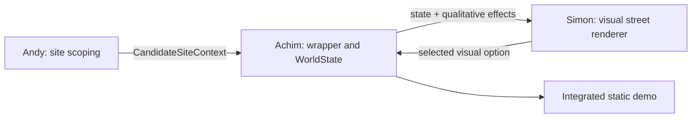

# Component ownership and integration seam

The three workstreams meet through contracts, not shared UI internals.

## Andy — place evidence and prioritisation

- Owns the Basel site-scoping tool, candidate locations, data audit, and the evidence needed to decide which place merits investigation.
- Publishes a bounded candidate context: identity, geometry/selection, known signals, provenance, and unknowns.
- Does not need to know how the street renderer draws an intervention.

## Achim — integration, state semantics, and evidence discipline

- Owns the wrapper, build integration, WorldState contracts, intervention runtime, scenarios, effect engine, and evidence/unknown handling.
- Translates supported UI selections into canonical interventions and returns a state projection plus qualitative effects.
- Refuses to turn an unsupported visual concept into a fake numeric prediction.

## Simon — visual scene and interaction

- Owns the layered street artwork, canvas composition, weather presentation, intervention controls, animation, and responsive visual experience in `frontend/v1/`.
- Sends selected option identifiers through `worldstate-adapter.js`.
- Renders the engine result; it does not calculate hydrology or temperature itself.

## Current bridge

`frontend/v1/worldstate-adapter.js` is the explicit anti-corruption layer between Simon's visual vocabulary and Achim's canonical intervention catalogue.

- Exact: green roof.
- Partial projection: combined sidewalk artwork → tree trench; native habitat → a 20 m² depaving intervention.
- Visual concept only: blue-green roof, permeable carriageway surfaces, constructed wetland, retention ponds, and floodable park. These remain selectable, but the interface says that no exact executable WorldState recipe exists yet.

The current place is the synthetic demo fixture. Andy's real candidate context can replace that provider later without changing Simon's renderer.
